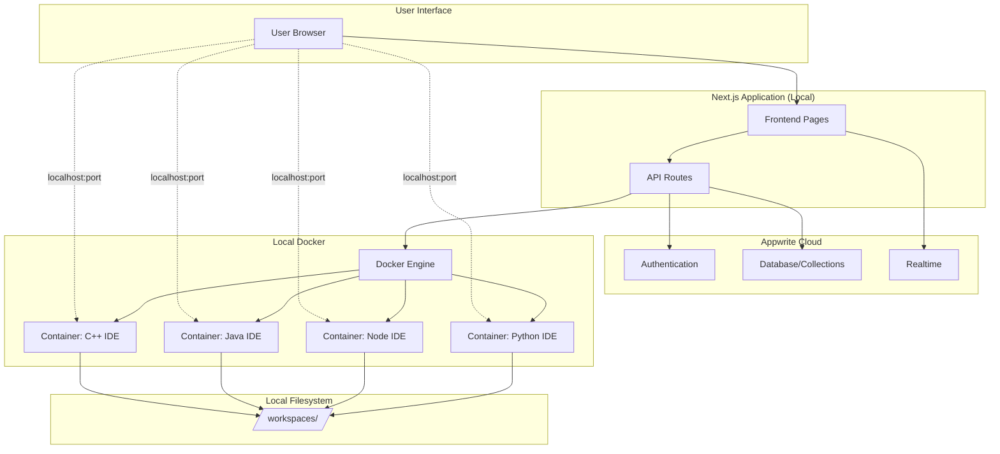

# CollabCode Local Architecture Documentation

## Overview

CollabCode currently runs as a local development environment using Docker containers for IDE instances. This document captures the current implementation before migrating to AWS.

## System Architecture



## Docker Implementation

### Location
- **Main Logic**: `/apps/web/src/lib/docker.ts`
- **Dockerfiles**: `/docker/` directory

### Stack Images

Custom Docker Hub images hosted under `rohankrsingh/*`:

| Stack ID | Image | Runtime Version |
|----------|-------|----------------|
| `nodejs-basic`, `react-vite`, `html-css-js` | `collabcode-openvscode-node:20` | Node.js 20 LTS |
| `python-basic`, `dsa-practice` | `collabcode-openvscode-python:3.12` | Python 3.12 |
| `next-js` | `collabcode-openvscode-nextjs:20` | Next.js + Node 20 |
| `java-basic` | `collabcode-openvscode-java:21` | OpenJDK 21 (Temurin) |
| `cpp-basic` | `collabcode-openvscode-cpp:bookworm` | g++ on Debian Bookworm |

### Container Configuration

Each container is started with:

```bash
docker run -d \
  --name ovscode-{roomId} \
  -p {port}:3000 \
  -p {port+1}-{port+5}:5173-5177 \  # Vite dev server
  -p {port+6}-{port+10}:3001-3005 \ # Additional app ports
  -p {port+11}-{port+15}:8080-8084 \ # Java/misc ports
  -v {absWorkspacePath}:/home/workspace \
  -e OPENVSCODE_USER_DATA_DIR=/home/workspace/.openvscode-data \
  {dockerImage} \
  --host 0.0.0.0 --port 3000 --without-connection-token
```

**Port Allocation**: Random port between 4000-6000

### Key Functions

| Function | Purpose |
|----------|---------|
| `startOpenVSCode()` | Creates and starts container |
| `stopContainer()` | Stops running container |
| `restartContainer()` | Restarts stopped container |
| `isContainerRunning()` | Health check |
| `getContainerPort()` | Retrieves mapped port |
| `removeContainer()` | Cleanup on deletion |

## Workspace Management

### Location
- **Logic**: `/apps/web/src/lib/workspaces.ts`
- **Storage**: `/workspaces/<roomId>/`

### Workspace Initialization

On room creation:

1. Create directory: `/workspaces/<roomId>/`
2. Write stack template files
3. Write VS Code settings (`.vscode/settings.json`)
4. Mount to container at `/home/workspace`

### Persistence

Workspaces persist across container restarts via Docker volume mount:
```
-v /absolute/path/to/workspaces/{roomId}:/home/workspace
```

## Stack Templates

### Location
`/apps/web/src/templates/stacks.ts`

### Template Structure

Each stack defines:
```typescript
{
  id: string;           // Unique identifier
  name: string;         // Display name
  description: string;  // User-facing description
  language: string;     // Primary language
  category: string;     // Grouping
  tags: string[];       // Search/filter tags
  files: {              // Starter files
    path: string;
    content: string;
    description?: string;
  }[];
}
```

### Available Stacks

1. **nodejs-basic**: Basic Node.js setup with Express example
2. **react-vite**: Vite + React starter
3. **html-css-js**: Static HTML/CSS/JS template
4. **next-js**: Next.js App Router setup
5. **python-basic**: Python with pip requirements
6. **dsa-practice**: LeetCode-style Python DSA template
7. **java-basic**: Maven-based Java project
8. **cpp-basic**: C++ with CMake

## API Endpoints

### Room Creation Flow

**Endpoint**: `POST /api/rooms/create`

Flow:
1. Validate stack ID
2. Authenticate user via Appwrite
3. Generate room ID: `room_{timestamp}{random}`
4. Create workspace directory
5. Write template files
6. Allocate random port
7. Start Docker container
8. Create Appwrite document
9. Add owner as member
10. Return `{ roomId, ideUrl, status }`

**Rollback**: On failure, deletes workspace and Appwrite doc

### Room Control

| Endpoint | Action | Docker Command |
|----------|--------|----------------|
| `POST /api/rooms/[roomId]/start` | Start stopped room | `docker start {container}` |
| `POST /api/rooms/[roomId]/stop` | Stop running room | `docker stop {container}` |
| `GET /api/rooms/[roomId]/status` | Check status | `docker ps --filter name={container}` |
| `DELETE /api/rooms/[roomId]/delete` | Remove room | `docker rm {container}` + delete workspace |

## Database Schema (Appwrite)

### Collection: `rooms`

```json
{
  "$id": "room_xyz123",
  "name": "My Python Project",
  "language": "python",
  "stackId": "python-basic",
  "ownerId": "user_abc456",
  "status": "running",
  "containerName": "ovscode-room_xyz123",
  "port": 4523,
  "ideUrl": "http://localhost:4523",
  "workspacePath": "/path/to/workspaces/room_xyz123",
  "isPublic": true,
  "createdAt": "2024-01-26T10:00:00.000Z"
}
```

### Collection: `room_members`

```json
{
  "roomId": "room_xyz123",
  "userId": "user_abc456",
  "role": "owner"
}
```

## Limitations of Local Setup

1. **Single Machine**: All containers run on one host
2. **No Auto-Scaling**: Manual resource management
3. **Port Conflicts**: Limited to ~2000 concurrent rooms
4. **No Load Balancing**: Direct port access
5. **Manual Cleanup**: Stopped containers persist
6. **Development Only**: No SSL, no domain routing

## Current Verification Status

✅ **Room Creation**: Working (verified via API)
✅ **Stack Templates**: 8 stacks defined with template files
✅ **Docker Containers**: 5 Dockerfiles built and pushed to Docker Hub
✅ **Workspace Persistence**: Volume mounts configured
⚠️ **Testing Needed**: End-to-end flow verification

## Next Steps for AWS Migration

This local setup will be replaced with:
- **Vercel**: Frontend/API hosting
- **ECS Fargate**: Container compute
- **EFS**: Persistent workspace storage
- **ALB**: Traffic routing
- **Orchestrator**: Centralized container management

All Docker commands in API routes will be replaced with orchestrator HTTP calls.
